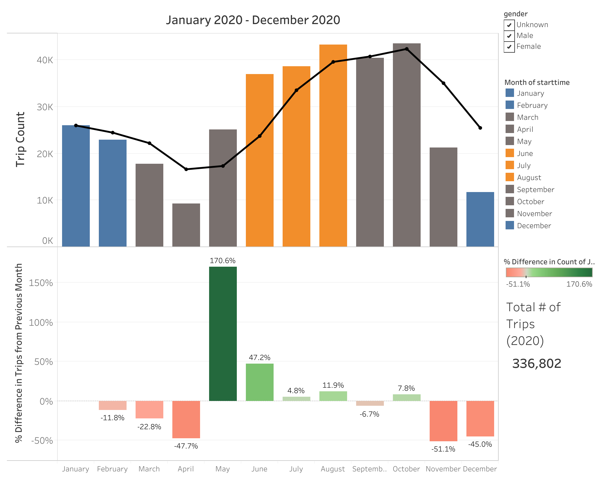
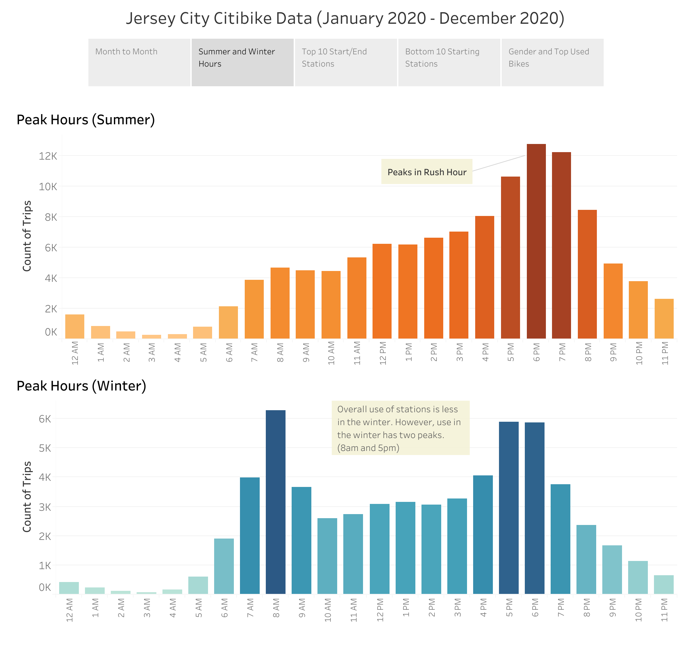
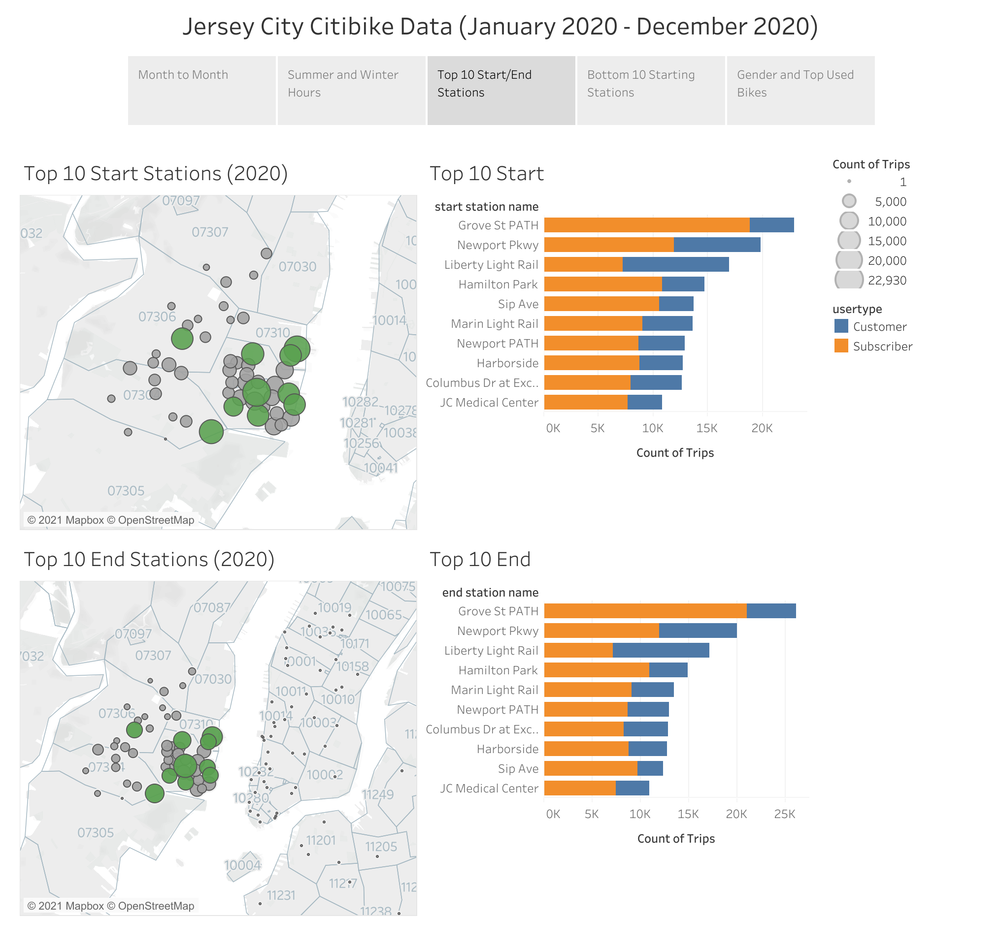
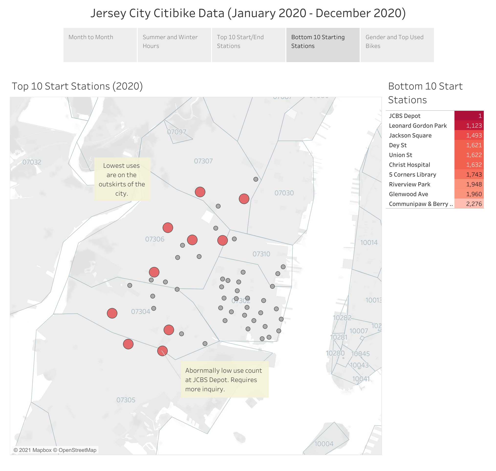
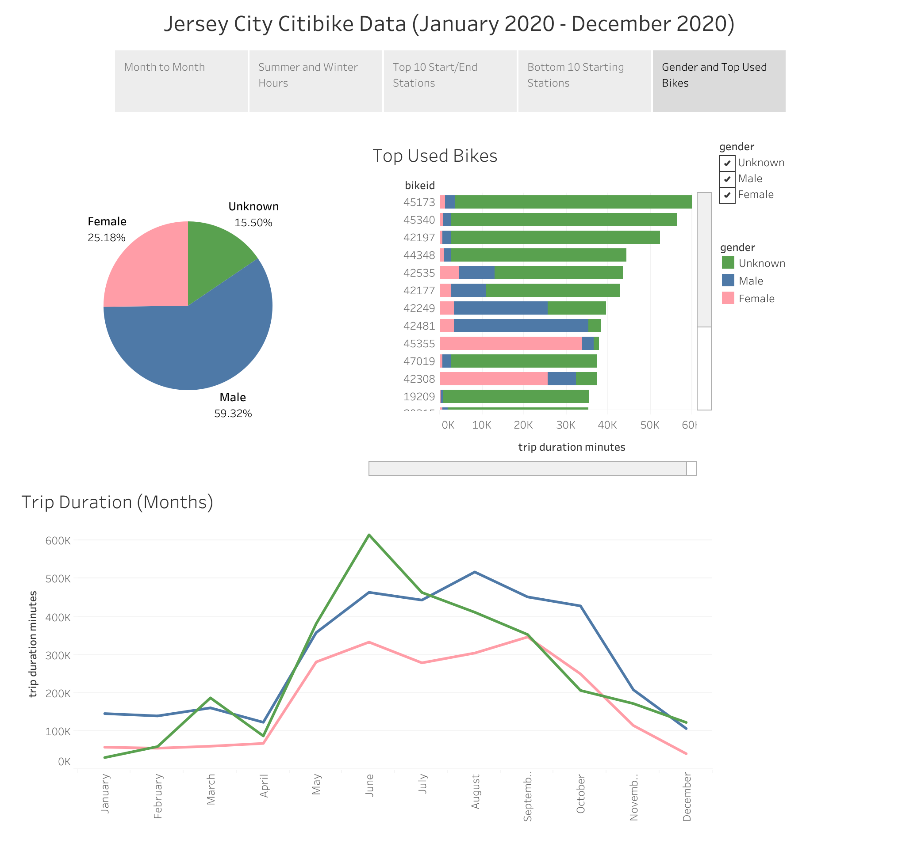

## Link to Visualization
https://public.tableau.com/profile/alexander.del.campo5224#!/vizhome/JC_Citybike2020/JCCitibike

### Jersey City Citybike Analysis:

**1. Month to Month**

The most important take away from here is that we can see that the summer months are seeing greater overall use than other seasons. April has an extremely low activity rate while October has seen the highest. It is important to pay attention to the increase in users in May so that Citibike can be prepared for an increase in equipment use.

**2. Summer/Winter Hours**

Here, the data indicates that bikes are used most during rush hour; this is more apparent during the winter. However, overall use in the winter is much lower.

**3. Top 10 Start/End Stations**

These maps indicate that use is much greater in the inner city. Generally, more than half of these users are subscribers.

**4. Bottom 10 Starting Stations**

The stations that are least used are on the outer parts of the city and away from the coast. Station JCBS Depot needs further inquiry as it barely has any records of use.

**5. Gender Distribution/Top Used Bikes**

Data reveals that a majority of users are male and that **15.50%** of them are unknown in gender. This data also shows that average trip durations rise in the summer and fall in the winter.

